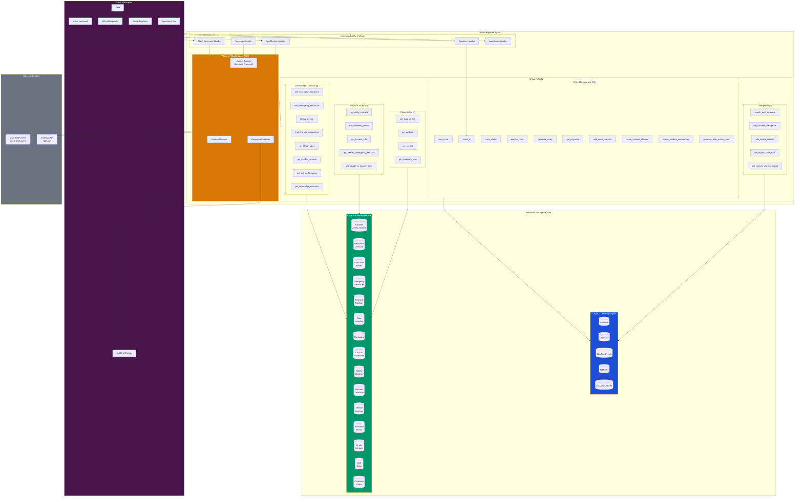
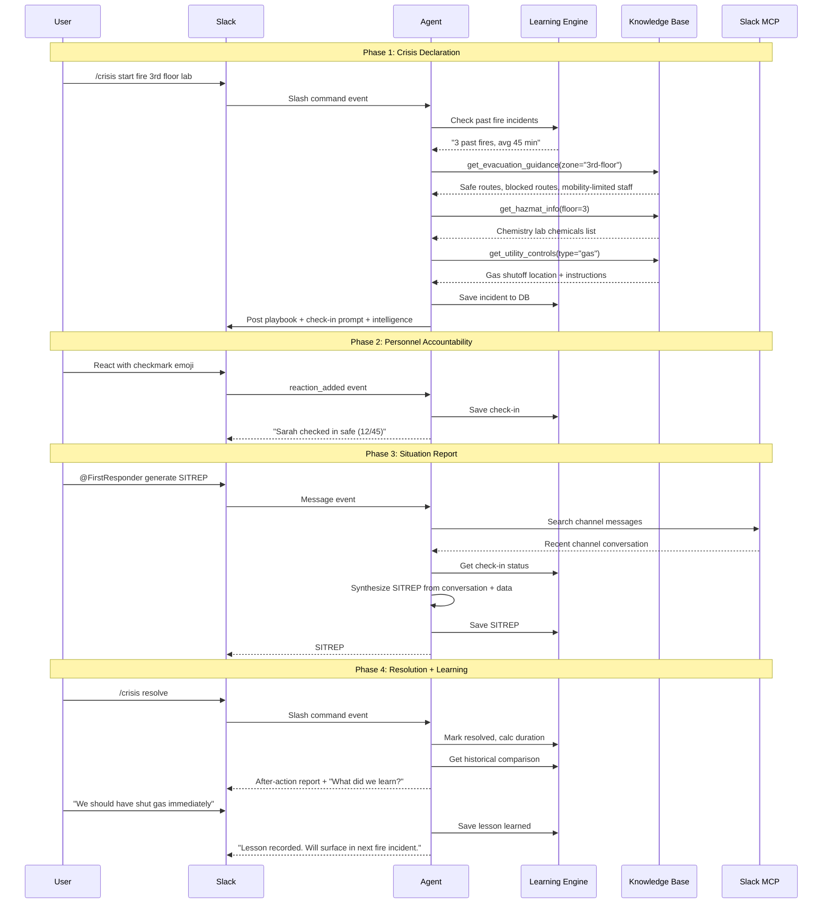
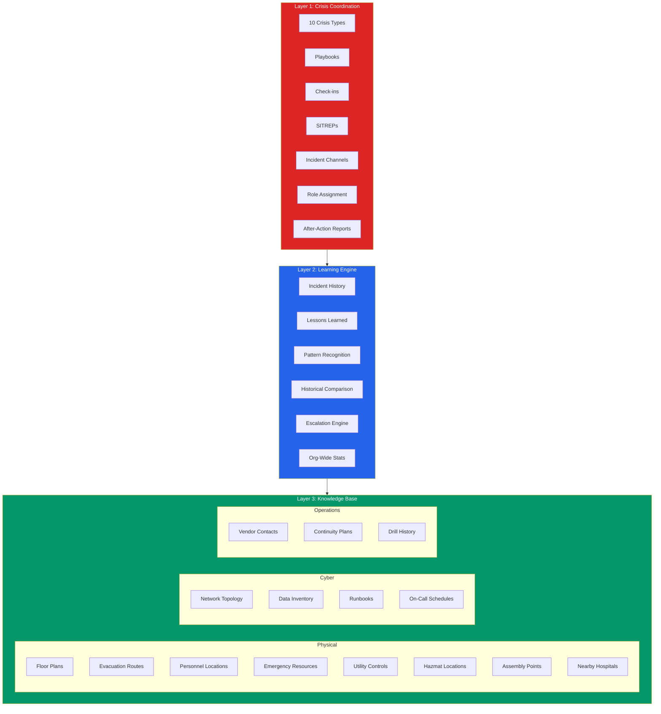

# FirstResponder Architecture

## System Overview



## Data Flow: Crisis Lifecycle



## Three-Layer Intelligence Model



## Scenario Intelligence Matrix

Each crisis type triggers a specific set of knowledge queries:

```
                    Physical Safety         Cyber/Data           Operations
                    ---------------         ----------           ----------
                    Evac  Util  Haz   Asm   Blast Data  Run  OC  Vendor Cont
                    Route Ctrl  Mat   Pts   Rad   Inv   Book     Cntct  Plan
    Fire            [x]   [x]   [x]   [x]
    Earthquake      [x]   [x]   [x]   [x]                       [x]  [x]
    Active Threat   [x]               [x]
    Flood           [x]   [x]   [x]         	                       [x]
    Medical
    Cyberattack                             [x]   [x]   [x]  [x] [x]
    Data Breach                             [x]   [x]   [x]  [x]
    Outage                                  [x]         [x]  [x] [x]  [x]
    Weather         [x]               [x]                        [x]  [x]

    + Every scenario uses: Personnel Lookup, Emergency Resources,
      Past Incident Search, Drill Benchmarks, Missing Person Escalation
```
